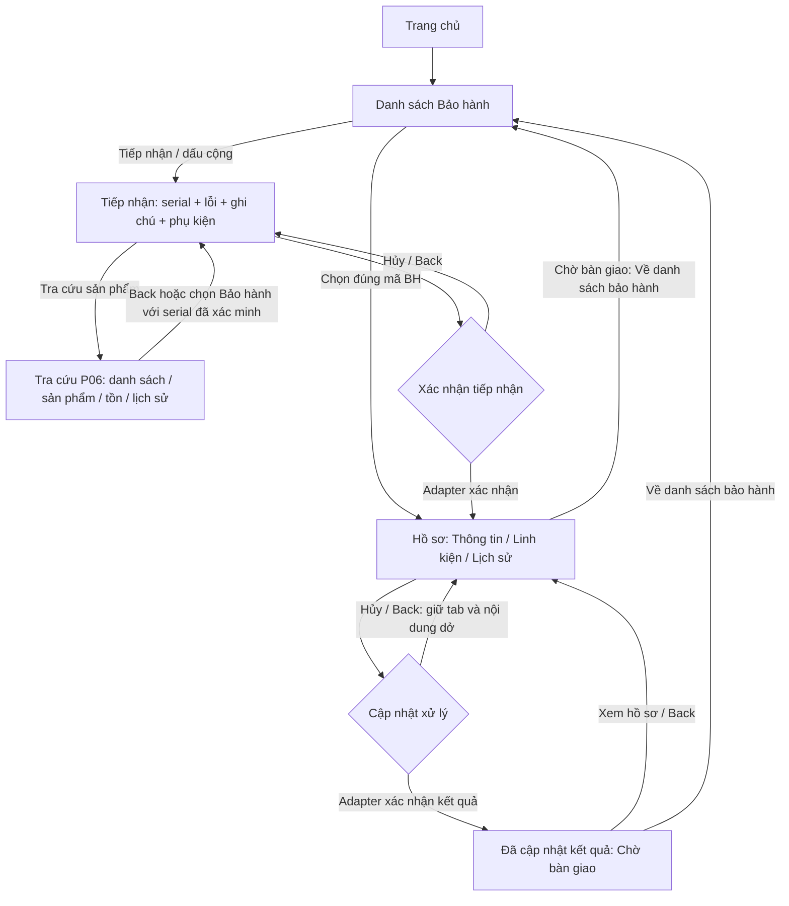

# User flow Bảo hành — P09 r08

Phạm vi: một kho Hoa Nam. Đây là luồng tương tác của prototype hiện tại; camera, API ghi và điều kiện bàn giao/đóng hồ sơ thật chưa tích hợp.

## 1. Vào Bảo hành

- Home → Bảo hành: mở danh sách hồ sơ. Tìm/lọc/sắp xếp rồi chọn đúng mã BH.
- Dấu cộng hoặc Tiếp nhận: mở form tiếp nhận mới/đang làm dở trong phiên.
- Từ chi tiết sản phẩm P06 → Bảo hành: phải có serial được xác minh; mở tiếp nhận cho đúng serial. Thiếu serial thì chặn, không lấy mã sản phẩm hoặc SKU thay thế.
- Từ chứng từ gần đây BH-001 trên Home: mở đúng hồ sơ. Back trả về Home là đúng trong trường hợp này, vì Home là màn gọi trực tiếp.

## 2. Tiếp nhận — P09.S02

1. Quét hoặc nhập serial; camera thật chưa kết nối. Có thể mở Tra cứu P06 để xem sản phẩm.
2. Xác định đúng sản phẩm, serial, khách hàng và liên hệ từ dữ liệu có sẵn; không tự tạo khách khi thiếu nguồn.
3. Chọn một trong18 tình trạng. Chỉ chọn **Khác** mới hiện mô tả bắt buộc. Ghi chú/phụ kiện là tùy chọn. Các nội dung bị giới hạn200 ký tự theo policy fixture hiện hành.
4. Tiếp nhận bảo hành mở dialog xác nhận Bước2/2. Back/Hủy chỉ đóng dialog, không bỏ form.
5. Xác nhận: adapter fixture trả thành công mới mở hồ sơ. Serial đã có hồ sơ thì mở hồ sơ đó, không tạo trùng hoặc ghi đè thông tin cũ; serial mới có context hợp lệ thì tạo hồ sơ mẫu mới.

Tra cứu là một nhánh phụ của bước tiếp nhận. Back từ danh sách Tra cứu trở về **đúng form P09**, còn Back trong chi tiết/tồn/lịch sử P06 đi từng cấp của P06 trước. Nếu chọn Bảo hành ở sản phẩm P06, serial được đưa về form ban đầu; không tạo một vòng P06 ↔ P09 mới. Lỗi, ghi chú, phụ kiện, ô nhập tay và vị trí cuộn được giữ trong phiên.

## 3. Hồ sơ — P09.S03

- **Thông tin:** xem dữ liệu hồ sơ và tình trạng tiếp nhận.
- **Linh kiện:** chỉ hiện phiếu POSTED của đúng hồ sơ trong dữ liệu đã tải. Nháp không được tính vào linh kiện đã xuất.
- **Lịch sử:** timeline dùng chung nguồn case/events với Lịch sử bảo hành.
- Ba tab thuộc cùng một hồ sơ, không phải ba bước tạo phiếu. Khi mở màn/dialog con, hệ thống nhớ tab đang chọn và trở lại đúng tab đó.
- Hồ sơ đã trả khách chỉ đọc, thao tác cập nhật/xuất mới bị chặn ở handler.

## 4. Cập nhật xử lý và kết quả — P09.S03/S04

- Từ hồ sơ, mở Cập nhật xử lý; nhập chẩn đoán/kết quả sửa chữa.
- Hủy/Back: đóng dialog, giữ nội dung cập nhật dở và tab hồ sơ.
- Chỉ khi adapter xác nhận mới hiện kết quả **Chờ bàn giao**. Chưa phải Đã trả khách; không tự đóng hồ sơ hoặc thay đổi tồn.
- Xem hồ sơ hoặc Back từ kết quả trả về đúng hồ sơ và tab đã gọi cập nhật.
- **Về danh sách bảo hành** từ màn kết quả hoặc hồ sơ Chờ bàn giao trở về trang quản lý danh sách, giữ tìm kiếm/bộ lọc/sắp xếp. Nếu hồ sơ vừa cập nhật không khớp bộ lọc cũ, màn hình thông báo rõ thay vì tự bỏ lọc.
- Lỗi lưu giữ dialog và nội dung để thử lại. UNKNOWN khóa lưu, cần đối chiếu cùng request. Back khi đang lưu chỉ đóng dialog; response về muộn không tự kéo người dùng sang màn kết quả.
- Nháp cập nhật được giữ riêng cho từng hồ sơ trong phiên. Đổi hồ sơ không làm mất hoặc trộn nháp. Mở/chỉnh sửa rồi Hủy không xóa kết quả đã xác nhận trước đó.
- Nếu version hồ sơ đã thay đổi, giữ nháp và chặn ghi để đối chiếu; không tự ghi đè dữ liệu mới hơn.
- Back về form đã tiếp nhận có nút **Mở hồ sơ bảo hành**, mở lại dữ liệu đã lưu và không gửi tiếp nhận trùng.
- Khi kho tạm dừng, phiên có quyền hợp lệ vẫn xem được danh sách/hồ sơ; tiếp nhận/cập nhật vẫn bị khóa.

## Quy tắc Trở về

| Đang ở đâu | Back/Trở về phải đi đâu |
|---|---|
| Hộp chọn lỗi, bộ lọc, xác nhận, cập nhật | Đóng hộp trước, giữ nguyên màn và dữ liệu phía sau |
| P06 được mở từ Tiếp nhận | Đi ngược từng cấp P06; tại danh sách P06 thì trở lại Tiếp nhận |
| Hồ sơ vừa mở sau tiếp nhận | Về form Tiếp nhận đã gọi; Back tiếp mới về Danh sách |
| Hồ sơ mở từ Danh sách Bảo hành | Về Danh sách, giữ tìm kiếm/bộ lọc/scroll/focus |
| Kết quả sửa chữa | Về đúng hồ sơ và tab Thông tin/Linh kiện/Lịch sử trước đó |
| Nút Về danh sách bảo hành sau cập nhật hoặc khi Chờ bàn giao | Về danh sách đã mở trước đó; nếu chưa có thì mở danh sách trong cùng nhánh, không quay vòng qua kết quả |
| Tiếp nhận mở trực tiếp từ sản phẩm P06 | Về đúng chi tiết sản phẩm P06 |
| Danh sách Bảo hành | Về màn đã mở Bảo hành, thông thường là Home |
| Sau đăng xuất | Không khôi phục màn bảo vệ hay request của phiên cũ |

Nút Home trên thanh điều hướng là yêu cầu chủ động về Home, khác với nút Trở về của tiến trình. Back/Forward không gọi lại lệnh tiếp nhận/cập nhật và không tạo request mới. UNKNOWN vẫn giữ request ID/scanSessionId/version; phải đối chiếu trước khi retry.

## Phần chưa tích hợp

Xuất linh kiện P19, phân trang ledger thật P20, tiếp tục phiếu P21 và bàn giao/đóng hồ sơ P18/P24 vẫn là các dependency đã ghi trong bàn giao trước. Không biến nút pending thành thành công giả. Việc sửa Back ở r05 không có nghĩa các phần này đã hoàn tất.

## Bổ sung r10 (29/09/2026)

Serial hợp lệ → thu gọn scanner → focus Chọn lỗi. Đổi sản phẩm mở lại scanner; mã sai giữ sản phẩm/phiếu dở; Giữ sản phẩm hiện tại hủy việc đổi. Lọc nhanh và dialog dùng chung status, giữ query/filter/scroll khi Back. Hồ sơ cập nhật nằm ngoài bộ lọc có Xem hồ sơ trực tiếp, Back trở lại chính bộ lọc đó. Thông tin tiếp nhận và Xử lý sửa chữa tách nhóm trong cùng tab. Dialog xác nhận/kết quả theo HN-action-feedback-v1; Back đóng overlay trước khi rời panel. Xem REVISION_10.md.

## Sửa lỗi r11

Kiểm tra cùng serial hiện tại hoàn tất việc đổi trên UI, không reset request/receipt. Escape/Thu gọn khi đang đổi bỏ riêng serial chưa xác minh và giữ sản phẩm/ghi chú cũ. Enter trong search lỗi không tự chọn option ẩn; bấm option mới commit. Serial có hồ sơ cung cấp Mở hồ sơ [ID] chỉ đọc (kể cả đã trả khách), không cần nhập lại lỗi hoặc sinh request. Dialog cập nhật giữ định danh dài trong vùng cuộn và actions luôn tiếp cận. Xem REVISION_11.md.
